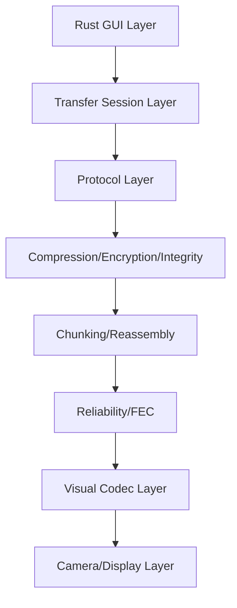

# OptiGap

OptiGap is a Rust-only desktop project for offline optical transfer:

- sender device displays encoded visual frames on screen
- receiver device captures with camera
- receiver decodes and reconstructs payload

No network, no cable, no USB, no Bluetooth required.

## Architecture



## Safety and consent

- Explicit user action is required on sender and receiver.
- Camera use is user-initiated and visible in UI.
- No hidden exfiltration behavior is implemented.
- Received files are never auto-opened.

## Current status (Phase 0 + Phase 1)

Implemented:

- Cargo workspace with modular crates
- `eframe/egui` desktop app skeleton
- Static QR text sender
- Camera QR receiver (decode loop)
- Core protocol/session/chunking utilities and tests
- Research and protocol docs scaffold

Not implemented yet:

- file transfer frames/chunk animation
- compression/encryption
- reliability/FEC strategies
- benchmark export UI

## Workspace

See root [Cargo.toml](Cargo.toml) and:

- [crates/optigap-app](crates/optigap-app)
- [crates/optigap-core](crates/optigap-core)
- [crates/optigap-protocol](crates/optigap-protocol)
- [crates/optigap-chunking](crates/optigap-chunking)
- [crates/optigap-codec-qr](crates/optigap-codec-qr)
- [crates/optigap-camera](crates/optigap-camera)

## Run

```bash
cargo run -p optigap-app
```

## Test

```bash
cargo test --workspace
```

## First manual flow

1. Open app on sender.
2. Sender tab: enter `hello world`.
3. QR is rendered.
4. Open app on receiver.
5. Receiver tab: pick camera, click `Start Scanning`.
6. Point receiver camera at sender screen.
7. Decoded text appears on receiver.

## Known limitations (Phase 1)

- Camera backend depends on OS camera permissions and backend support.
- Decode reliability depends on focus, distance, brightness, and refresh rate.
- No frame replay/missing-chunk handling yet.

## Roadmap

See [docs/mvp-roadmap.md](docs/mvp-roadmap.md).
