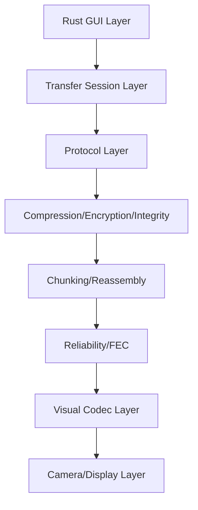

# StareDrop

StareDrop is a Rust-only desktop project for offline optical transfer:

- sender device displays encoded visual frames on screen
- receiver device captures with camera
- receiver decodes and reconstructs payload

No network, no cable, no USB, no Bluetooth required.

## Architecture



## Safety and consent

- Explicit user action is required on sender and receiver.
- Camera use is user-initiated and visible in UI.
- No hidden exfiltration behavior is implemented.
- Received files are never auto-opened.

## Current status (Phase 0 + Phase 1)

Implemented:

- Cargo workspace with modular crates
- CLI-first desktop runtime (`sender`, `receiver`, `list-cameras`)
- Fullscreen static QR sender (terminal-configured)
- Fullscreen camera QR receiver (terminal-configured)
- Core protocol/session/chunking utilities and tests
- Research and protocol docs scaffold

Not implemented yet:

- file transfer frames/chunk animation
- compression/encryption
- reliability/FEC strategies
- benchmark export UI

## Workspace

See root [Cargo.toml](Cargo.toml) and:

- [crates/staredrop-app](crates/staredrop-app)
- [crates/staredrop-core](crates/staredrop-core)
- [crates/staredrop-protocol](crates/staredrop-protocol)
- [crates/staredrop-chunking](crates/staredrop-chunking)
- [crates/staredrop-codec-qr](crates/staredrop-codec-qr)
- [crates/staredrop-camera](crates/staredrop-camera)

## Run

List camera devices:

```bash
cargo run -p staredrop-app -- list-cameras
```

Sender mode (inline payload):

```bash
cargo run -p staredrop-app -- sender --text "hello world"
```

Sender mode (payload from file):

```bash
cargo run -p staredrop-app -- sender --input-file ./payload.txt --input-format utf8
```

Sender mode (raw bytes as Base64 text in QR):

```bash
cargo run -p staredrop-app -- sender --input-file ./sample.bin --input-format base64
```

Receiver mode:

```bash
cargo run -p staredrop-app -- receiver --camera-index 0 --auto-start
```

Window options:

```bash
# disable fullscreen
cargo run -p staredrop-app -- --fullscreen false sender --text "hello"

# hide overlay text
cargo run -p staredrop-app -- --overlay false receiver --camera-index 0
```

## Test

```bash
cargo test --workspace
```

## First manual flow (Phase 1)

1. Run `list-cameras` and note receiver camera index.
2. Start sender using `sender --text "..."`
3. Start receiver using `receiver --camera-index N`
4. Receiver controls:
   - `Space`: start/stop scanning
   - `R`: refresh camera list
   - `Q` or `Esc`: quit
5. Point receiver camera at sender fullscreen QR.
6. Decoded text appears in receiver overlay and prints to terminal by default.

## Known limitations (Phase 1)

- Camera backend depends on OS camera permissions and backend support.
- Decode reliability depends on focus, distance, brightness, and refresh rate.
- Phase 1 transfers text payload only (no multi-frame file transfer yet).
- No frame replay/missing-chunk handling yet.

## Terminal Usage Reference

See [docs/terminal-usage.md](docs/terminal-usage.md).

## Roadmap

See [docs/mvp-roadmap.md](docs/mvp-roadmap.md).
