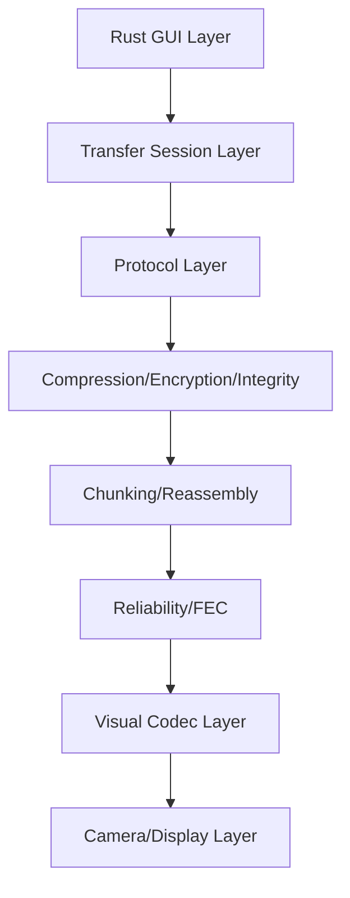

# StareDrop

StareDrop is a Rust-only desktop project for offline optical transfer:

- sender device displays encoded visual frames on screen
- receiver device captures with camera
- receiver decodes and reconstructs payload

No network, no cable, no USB, no Bluetooth required.

## Architecture



## Safety and consent

- Explicit user action is required on sender and receiver.
- Camera use is user-initiated and visible in UI.
- No hidden exfiltration behavior is implemented.
- Received files are never auto-opened.

## Current status (Phase 0 + Phase 2)

Implemented:

- Cargo workspace with modular crates
- CLI-first desktop runtime (`sender`, `receiver`, `list-cameras`, `simulate`)
- Fullscreen static QR sender (terminal-configured)
- Fullscreen camera QR receiver (terminal-configured)
- Phase 2 animated QR file transfer (manifest + data frames)
- Camera-free simulation mode for automated sender->QR->decode->receiver benchmarking
- Chunking/reassembly + CRC validation
- End-to-end SHA-256 verification and output save path controls
- Core protocol/session/chunking utilities and tests
- Research and protocol docs scaffold

Not implemented yet:

- compression/encryption
- reliability/FEC strategies
- benchmark export UI

## Workspace

See root [Cargo.toml](Cargo.toml) and:

- [crates/staredrop-app](crates/staredrop-app)
- [crates/staredrop-core](crates/staredrop-core)
- [crates/staredrop-protocol](crates/staredrop-protocol)
- [crates/staredrop-chunking](crates/staredrop-chunking)
- [crates/staredrop-codec-qr](crates/staredrop-codec-qr)
- [crates/staredrop-camera](crates/staredrop-camera)

## Run

List camera devices:

```bash
cargo run -p staredrop-app -- list-cameras
```

Sender mode (inline payload):

```bash
cargo run -p staredrop-app -- sender --text "hello world"
```

Sender mode (payload from file):

```bash
cargo run -p staredrop-app -- sender --input-file ./payload.txt --input-format utf8
```

Sender mode (raw bytes as Base64 text in QR):

```bash
cargo run -p staredrop-app -- sender --input-file ./sample.bin --input-format base64
```

Sender mode (Phase 2 file transfer via animated QR):

```bash
cargo run -p staredrop-app -- sender --send-file ./payload.bin --chunk-size 700 --fps 8
```

Receiver mode:

```bash
cargo run -p staredrop-app -- receiver --camera-index 0 --auto-start --output-dir ./received
```

Receiver mode with explicit output file (fails if file already exists):

```bash
cargo run -p staredrop-app -- receiver --camera-index 0 --output-file ./received/out.bin
```

Window options:

```bash
# disable fullscreen
cargo run -p staredrop-app -- --fullscreen false sender --text "hello"

# hide overlay text
cargo run -p staredrop-app -- --overlay false receiver --camera-index 0
```

Simulation mode (camera-free end-to-end benchmark):

```bash
# default suite: 1KB, 10KB, 100KB, 1MB, text
cargo run -p staredrop-app -- simulate

# custom file with stress knobs
cargo run -p staredrop-app -- simulate \
  --input-file ./payload.bin \
  --chunk-size 700 \
  --loops 2 \
  --drop-every 9 \
  --corrupt-every 17 \
  --reverse-data-order true \
  --output-dir ./manual-tests/sim-output-lossy
```

Simulation outputs:

- `<output-dir>/received/...` reconstructed files (when transfer completes)
- `<output-dir>/simulation-summary.csv` benchmark metrics
- `<output-dir>/simulation-summary.txt` human-readable summary

## Test

```bash
cargo test --workspace
```

## First manual flow (Phase 2)

1. Run `list-cameras` and note receiver camera index.
2. Start sender using `sender --send-file ./payload.bin --chunk-size 700 --fps 8`
3. Start receiver using `receiver --camera-index N --auto-start --output-dir ./received`
4. Receiver controls:
   - `Space`: start/stop scanning
   - `R`: refresh camera list
   - `S`: manual save when auto-save is disabled
   - `Q` or `Esc`: quit
5. Point receiver camera at sender fullscreen QR animation.
6. Receiver reconstructs chunks and saves when complete.

## Known limitations (Phase 2)

- Camera backend depends on OS camera permissions and backend support.
- Decode reliability depends on focus, distance, brightness, and refresh rate.
- No adaptive retransmit yet (sender currently loops full frame set).
- No compression/encryption yet.
- No FEC yet.
- Lossy/corrupted simulated links can fail to complete without FEC (expected in Phase 2).

## Terminal Usage Reference

See [docs/terminal-usage.md](docs/terminal-usage.md).

## Roadmap

See [docs/mvp-roadmap.md](docs/mvp-roadmap.md).
